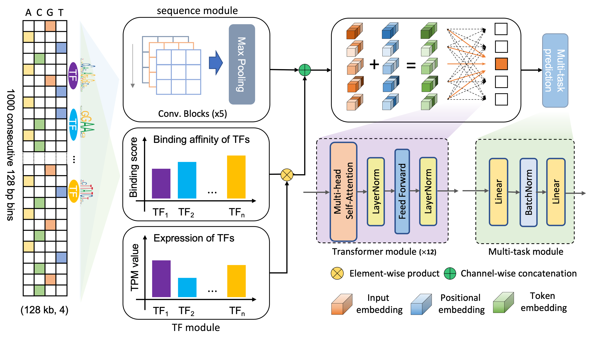

# EpiGePT

<div align=center>

</div>  

EpiGePT is a transformer-based model for cross-cell-line prediction of chromatin states by taking long DNA sequence and transcription factor profile as inputs. This is a script for reproducing EpiGePT using TensorFlow.


## Table of Contents

- [EpiGePT](#epigept)
  - [Table of Contents](#table-of-contents)
  - [Install](#install)
  - [Reproduction](#reproduction)
    - [Data downloading](#data-downloading)
    - [Data preprocessing](#data-preprocessing)
    - [Model training](#model-training)
  - [Contact](#contact)
  - [Citation](#citation)
  - [License](#license)

## Install

EpiGePT can be downloaded by
```shell
git clone https://github.com/kimmo1019/EpiGePT
```

Software has been tested on a Linux and Python 3.6 environment. A GPU card is recommended for accelerating the training process.

## Reproduction

This section provides instructions on how to reproduce results in the original paper.

### Data downloading

We provided `Download_raw_data.sh` for download RNA-seq data (.tsv), DNase-seq data (.bam) and ChIP-seq data (.bam) from the ENCODE project
We pre-defined cell type ID from 1-37. After downloading the meta data from ENCODE website (`head -n 1 files.txt|xargs -L 1 curl -O -L`), one can run the following script:


```python
bash Download_raw_data.bash  -c <CELL_ID> -r -c -d
-c  CELLID: pre-defined cell ID (from 1 to 55)
-r  download RNA-seq data (.tsv)
-d  download chromatin accessible readscount from DNase-seq data (.bam)
-c  download readscount from ChIP-seq data (.bam)
```
one can also run ```bash Download_raw_data.bash  -h``` to show the script instructions. Note that `.bam` files downloading may take time. After downloading the raw data, the raw data folder will be organized by `cell-assay-experiment-file` order. Note that each experiment may contain multiple replicates. See an example of the folder tree:

```
data/
    |-- raw_data/
    |   |-- 1/
    |   |   |-- dseq/
    |   |   |   |-- ENCSR000EIE/
    |   |   |   |   |-- ENCFF953HEA.bed.gz
    |   |   |   |   |-- ENCFF983PML.bam
    |   |   |   |-- ENCSR000ELW/
    |   |   |   |   |...
    |   |   |-- rseq/
    |   |   |   |-- ENCSR000BXY/
    |   |   |   |   |-- ENCFF110IED.tsv
    |   |   |   |   |-- ENCFF219FVQ.tsv
    |   |   |   |-- ENCSR000BYH/
    |   |   |   |   |...
```

### Data preprocessing

After downloading the raw DNase-seq, RNA-seq and ChIP-seq data, you can align BAM files to the reference sequence to obtain read counts. Users can use the following command for alignment:

```shell
bash runme.sh
```

Then we merge multiple replicate of RNA-seq data by taking the average expression of each gene across replicates in a cell type. As for DNase-seq data and ChIP-seq data, we only keep bins that appear in more than half of the replicates with respect to a cell type. One can run the following scripts to merge relicates of both DNase-seq, ChIP-seq and RNA-seq data, and generate TF gene expression matrix (N x C where N is the number of TFs and C is the number of cell types).

Additionally, users can also obtain the motif binding score of motifscan results by homer tool.

```shell
python preprocess.py
```

As for the motif binding score, we conducted scanning of 711 transcription factors across the entire genome and integrated them into the [EpiGePT-online](http://health.tsinghua.edu.cn/epigept/) platform, enabling users to directly perform predictions through the web interface. 


### Model training


The main python script `main.py` is used for implementing EpiGePT for predicting 8 epigenomic profiles. 
One can run the following commond to train a EpiGePT model, the preprocessed data of TF expression value can be downloaded from the `Supplementary Materials` of EpiGePT.

```shell
python main.py
```


## Contact

Please feel free to open an issue in Github or directly contact `gzj21@mails.tsinghua.edu.cn` `liuqiao@stanford.edu` if you have any problem in EpiGePT.


## Citation

If you find EpiGePT useful for your work, please consider citing our paper:

**Zijing Gao**, **Qiao Liu**, Wanwen Zeng, Wing Hung Wong and Rui Jiang. EpiGePT: a Pretrained Transformer model for epigenomics

## License

This project is licensed under the MIT License - see the LICENSE.md file for details


